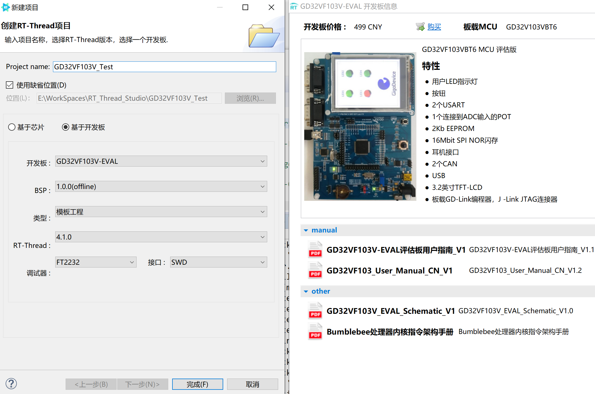
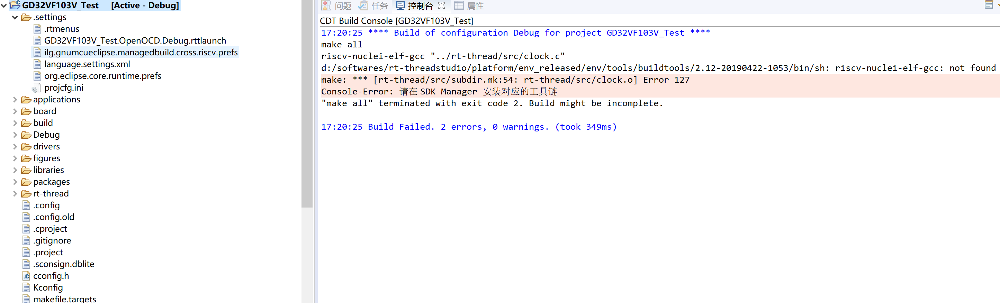
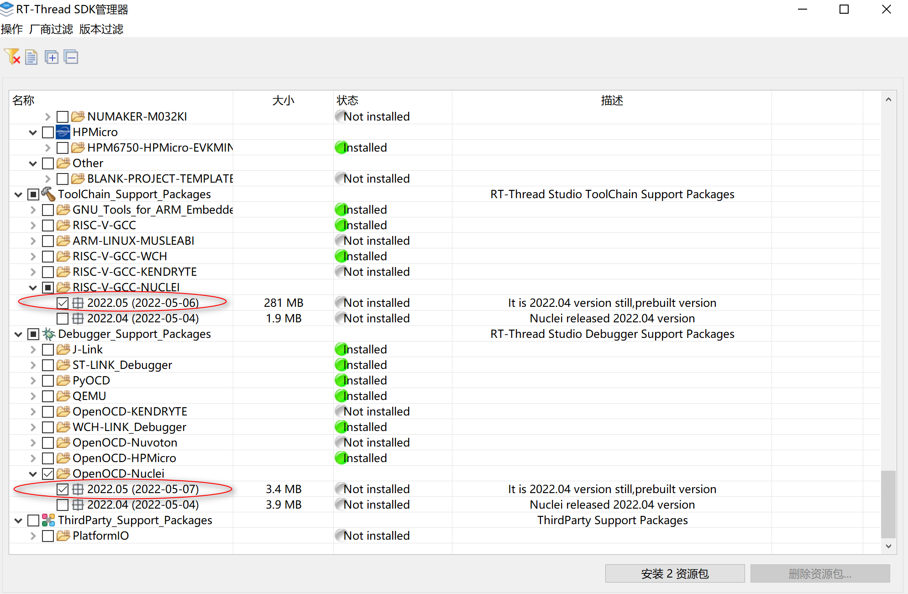
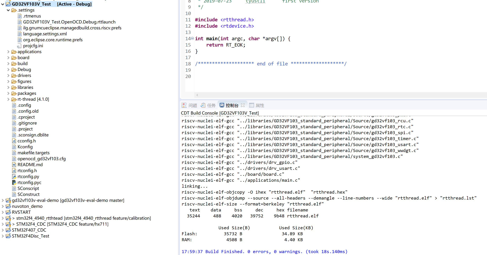
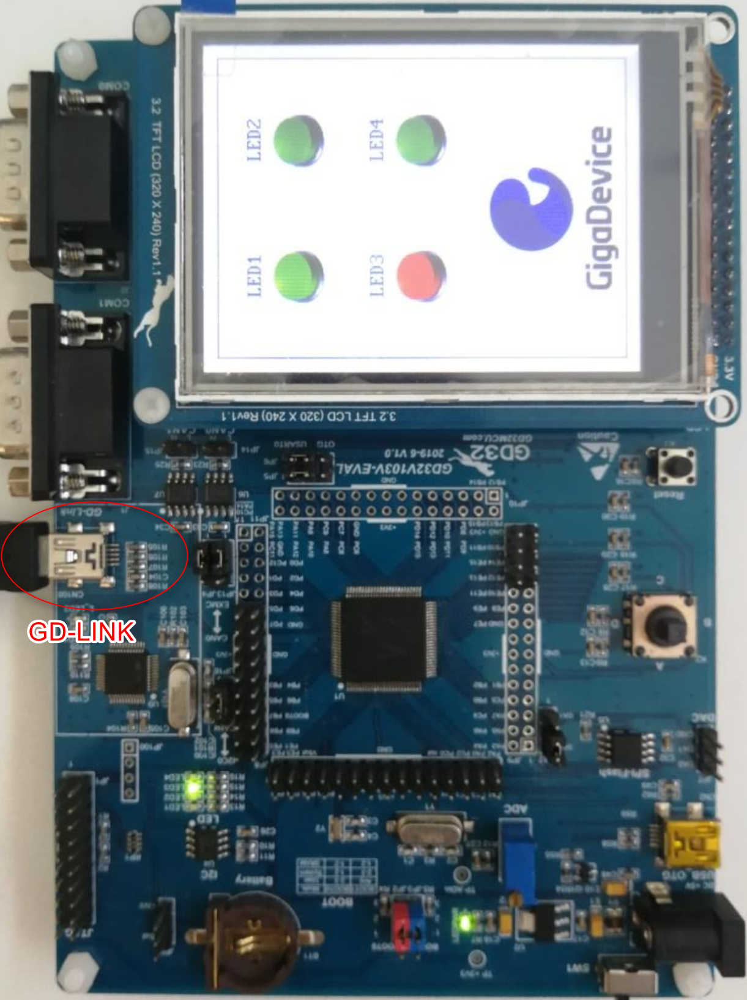
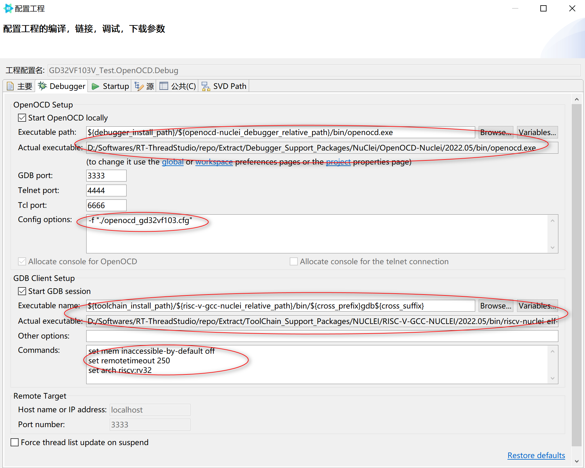
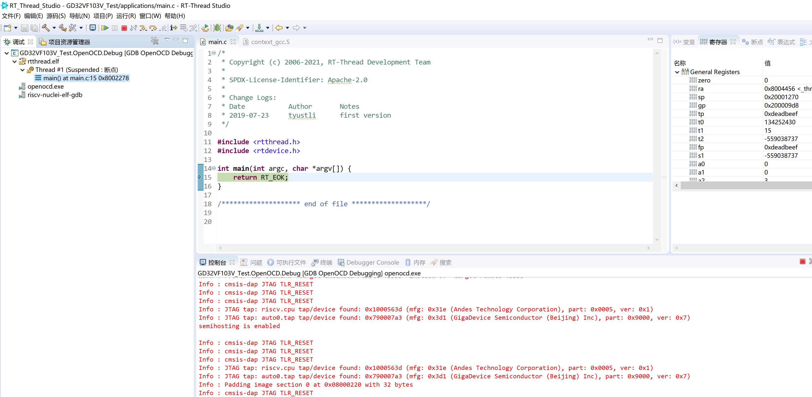

# GD32VF103 #

## 简介

gd32vf103v-eval 是由兆易创新公司推出的基于开源指令集 RISC-V 架构的开发板。

### 板载资源：

| 硬件 | 描述 |
| -- | -- |
| 内核    | Bumblebee                                     |
| 架构       |  32-bit RV32IMAC                                         |
| 主频       | 108 MHz                                              |

## 编译说明

### 基于SDK新建工程



### 安装芯来GCC和OpenOCD

未安装对应工具链，首次编译会报错




在SDK Manger里安装最新的`RISC-V-GCC-NUCLEI` 和 `OpenOCD-Nuclei`两个软件包



再次编译，正常




## 下载和调试

### GD-LINK

gd32vf103v-eval板载GD-LINK和 外部Jlink接口，此处使用板载GD-LINK进行下载和调试




### OpenOCD配置

GD-LINK 基于Nuclei的OpenOCD 工具`OpenOCD-Nuclei`，请提前在SDK管理器下载好。OpenOCD的配置部分，使用默认生成的配置就行，无需更改



> - OpenOCD 和 GDB 与环境变量相关，不同电脑，不同的安装路径无影响
> - 系统根目录下的 openocd_gd32vf103.cfg 不能删除，配置选项里用到，该文件主要配置GD-Link参数
> - Commands 默认即可


### 启动调试

单击菜单栏里的`应用调试`按钮，即可启动OpenOCD下载和调试。 



> GD-LINK 启动过程很耗时间，大概花费半分钟左右，请耐心等待！！！


### 运行结果

控制台输出在UART0（GPIO 9/10）

下载程序之后，连接串口(115200-N-8-1)，可以看到 RT-Thread 的输出信息：

```
 \ | /
- RT -     Thread Operating System
 / | \     4.1.0 build May 10 2022 18:51:11
 2006 - 2022 Copyright by RT-Thread team
msh >ps
thread   pri  status      sp     stack size max used left tick  error
-------- ---  ------- ---------- ----------  ------  ---------- ---
tshell    20  running 0x00000140 0x00001000    16%   0x00000009 000
tidle0    31  ready   0x000000a0 0x00000100    67%   0x00000011 000
timer      4  suspend 0x000000c0 0x00000200    37%   0x00000009 000
msh >

```

## 驱动支持情况

| 驱动 | 支持情况  |  备注  |
| ------ | ----  | :------:  |
| USART | 支持 | UART0_TX/RX：GPIO 9/10 |

## 5. 联系人信息

维护人：
- [blta](https://github.com/blta)

